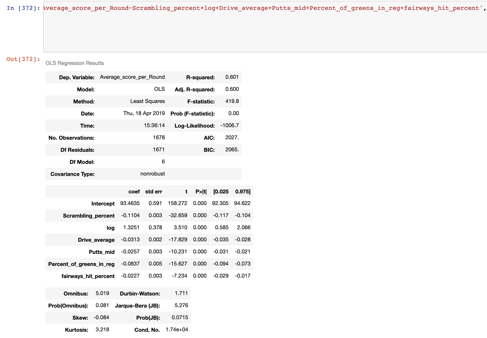
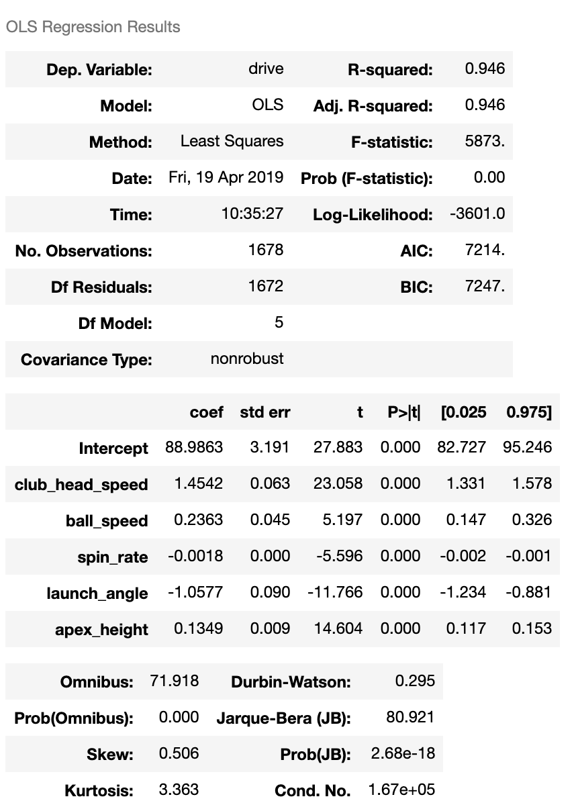
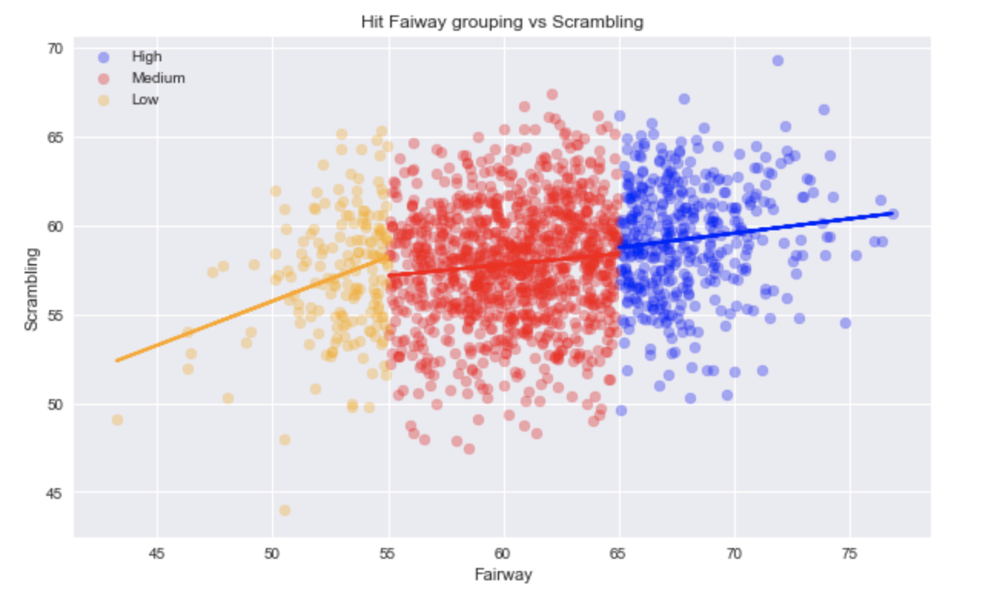
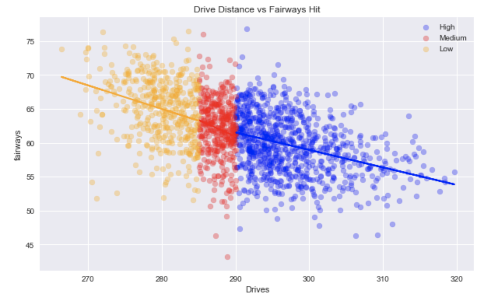

# Golf-Project-for-mod-2
I took a PGATour.com Webscraped Dataset from Kaggle and ran a few regressions to try to predict which variables affect average score, along with Driver Distance. The Dataset had nested lists and dictionaries. I used average score as my dependent variable and using fairways hit, scrambling, drive distance, average putts per hole putting from 10-15ft. i was able to get an R squared .60 by dropping average putts per hole and using putts from 10-15 feet instead.

I also wanted to see what factors contributed to driver distance. the variables i used was club head speed, ball speed, spin rate, launch angle, apex height, and smash factor. I dropped smash factor out of the regression, and found that clubhead speed and launch angle were the most important coefficients when determining driver distance.

I ran a few interactions to see how fairways hit and the scrambling factors interacted. I broke it down into lower than 55%, between 55 and 65% and greater than 65%. Scrambling seems to have a more positive relationship to scrambling which was interesting to see. 

After seeing that interaction i wanted to see the interaction between fairways hit and driver distance. I broke driver distnace down into three groups gan. Below 285yds, between 285 and 290 and greater than 290 yds. there is a negative relationship which makes sense.

Looking back i can see that the bigger hitters were missing fairways more often and scrambling at a better rate than the rest of the field. That could be due to the fact that they are hitting the ball so close to the green right away and they are better. 
